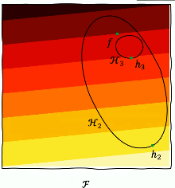
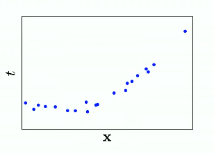
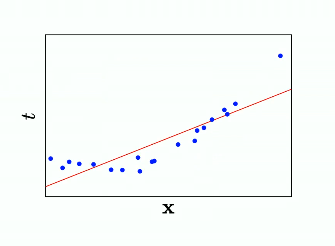
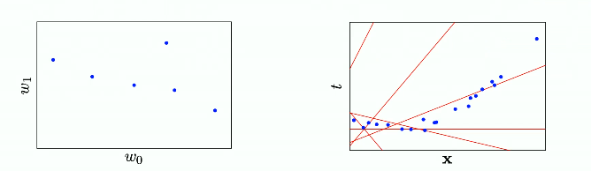
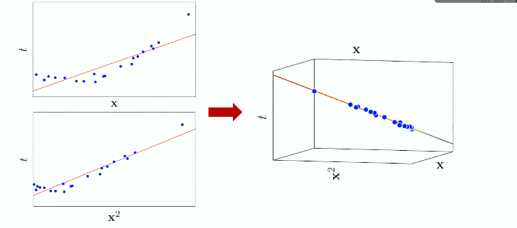
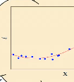

# Linear regression (Part 1)

## Overview of supervised learning 

### What kind of problem are we trying to solve ?
We're trying to find/approximate a funcition $f$, which is "generating" our dataset $D$.
The steps are:
- Define a loss function $L$
- Choose the hypothesis space $\mathcal{H}$
- Find in $\mathcal{H}$ an approximation $h$ of $f$ that minimizes $L$.
 
We might be tempted to enlarge the hypothesis space, but if we do that we can have a larger risk of approximating $f$ very poorly as we don't know if we'd be expanding $\mathcal{H}$ in the correct direction.

### The elements of a supervised learning algorithim
- The representation meaning the hypothesis space $\mathcal{H}$ and how it's designed.
- The evaluation, so how the loss function is designed.
- The optimization algorithim, how you're looking for candidate soltutions.

Some examples of representations are:
- Linear models.  
- Neural networks. 

Evaluation: 
- Accuracy, the % of time you're correctly classifying a datapoint.
- If you have a regression problem you could use MSE.

Finally, the optimization technique really depends on your loss function:
- Gradient descent.
- Greedy search.
- Linear programming (in cases where you have some sort of constraint)

## A supervised learning taxonomy
There are many ways you can try to classify/organize/compare, some more general paradigms other than the previous three.
### Parametric vs Non-parametric

There are some learning algorithims for which the deisgn of the hypothesis space is such that when you decide to apply a learning algorithim to a problem you have to define a set of parameters that are fixed and won't change with the data these are called **Parametric**, while non parametric models scale the number of parameters with the training set.

### Frequentist vs Bayesian

No meaningful definition given by the prof here.

### Direct, discriminative or generative

They're different ways to see the same problem from different perspectives, in the **direct** approach you don't really care about the probabilstic interpretation, you're just optinmizing the loss function. In the **discriminative** you interpret your problem as a conditional density $p(t|x)$ you essentially try to learn the distribution and then compute the expected mean. In the **generative**  tries to model the *joint* density $p(x,t)$, this allows to then infer the conditional density and generate novel samples by computing the conditional mean.

## Linear regression
We'll focus on regression as our first type of problem, more specifically on linear models to solve. 

References:
- *Pattern recognition and Machine learning*, Bishop

### The model 

We want to learn an approximation function $f(x)$:

We start from a dataset 
$\begin{equation}
\mathcal{D} = {<x,t>} \Longrightarrow t = f(x)
\end{equation}$
How do we model $f$ ? How do we evaluate our approximation ? How do we optimize our approximation ?

In linear regression we model $f(x)$ with linear functions.

 

A model like this clearly has room for improvement but we can veeery easily explain what the model is doing. Another important property is that we can solve this analitically, this is better since models like NN are hard to "debug", in this case nothing can go wrong, we have algorithims with guaranteed convergence etc...

Another thing is that these models can capture non linear interactions.

The simplest linear model can be defined as:

$$ y(x,w) = w_0 + \sum_{j=1}^{D-1}w_jx_j=w^Tx$$

Where:
- $x=(1,x_1,..,x_{D-1})$ is our input variable expressed as a vector to which we prepend $1$.
- $w_0$ is called the bias parameter

My hypothesis space is 2D space with the two weights as dimensions. 

Each point in the left image is a "solution" to our problem (a red line). We now need to *evaluate* these solutions, we need to define an error.

### Loss function and optimization

A convenient error loss function is the sum of squared errors (SSE):
$$L(w) = \frac{1}{2}\sum^{N}_{n=1}(y(x_n,w) - t_n)^2$$
The reason we take the square instead of the absolute value is that ???

## Linear models and basis functions

How do we capture non-linear relationships ? We can use basis functions. Instead of using $x_1,x_2,..x_n$ we can use a set of non-linear functions $\phi_i$ (as many as we want), my linear model will be *linear* with respect to the basis functions (we're learning the weights). 

In this example i generate 2 weights for each sample, one for $x$ and for $x^2$.

If we now plot this approximation into the original space:

If we have problem specific knowledge we can pinpoint some sort of specific basis functions but generally there's no rule.
There are *families* of basis functions such as :
- Polynomial :
$$\phi_j(x) = x^j$$
- Gaussian :
$$\phi_j(x) = exp\left(-\frac{(x-\mu_j)^2}{2\sigma^2}\right)$$
- Sigmoidal:
$$\phi_j(x) = \frac{1}{1+exp\left(\frac{\mu_j -x}{\sigma}\right)}$$

This can be hyper-parameterezide (idk how to spell it), more on this later in the course. 

## Least squares

From now on we'll assume that our problem is solved in the feature space and not in the input space (in the basis function space in the previous case).
